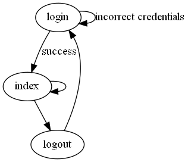

### build graph

```
dot -Tpng -O flow.gv
```

### invoke PHP

To invoke php:

```
C:\xampp\php\php.exe --help
```

### execute trivial PHP script

```
C:\xampp\php\php.exe -f trivial.php
```

### launch xampp environment

TODO

### pages



#### index.html

Hello, <username>

Links to:
* logout.html

#### login.html

Needs a form with the following fields:

* username
* password

#### logout.html

Needs a form with a logout button

### STATIC SITE

Hosted locally A:
* [index.html](index.html)
* [login.html](login.html)
* [logout.html](logout.html)

### STATIC SITE (PHP version)

* [index.php](index.php)
* [login.php](login.php)
* [logout.php](logout.php)

### generate these pages with php under apache with forms but WITHOUT sql connections

-Start Apache server.
-Files located at C:/xampp/htdocs/Gestor
-Open browser
-Go to URLs:
 * (https://localhost/Gestor/index.php)
 * (https://localhost/Gestor/login.php)
 * (https://localhost/Gestor/logout.php)
